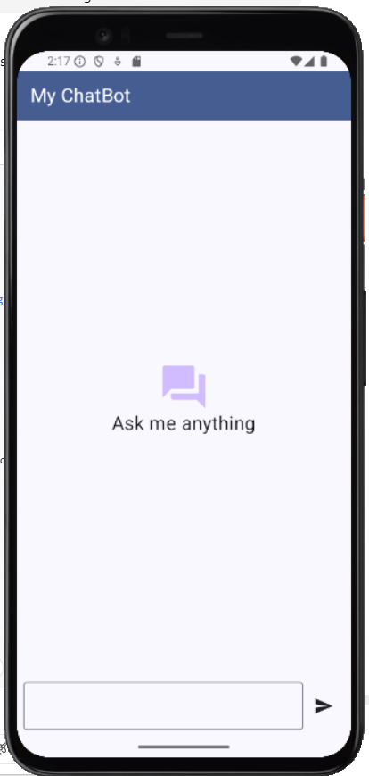
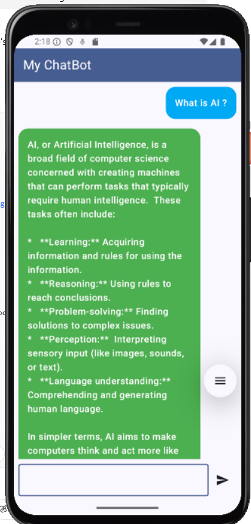
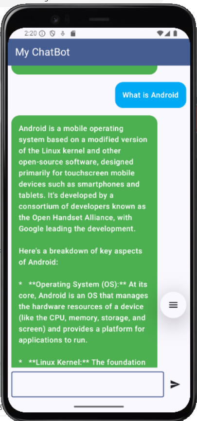
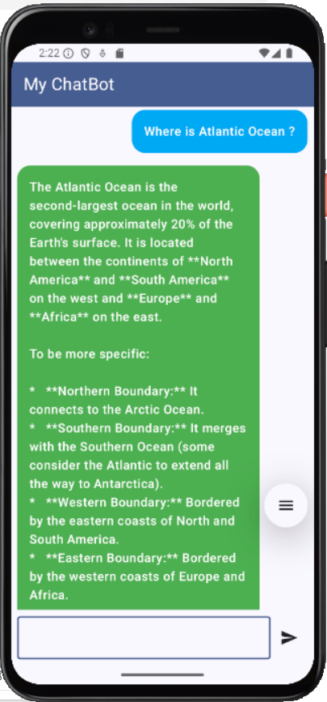

# 🤖 Android Jetpack Chatbot App
 
# Project Name: MyChatBotApp

A smart and responsive **Chatbot app** built using **Android Jetpack** components. This chatbot allows users to ask anything and receive answers in real-time.


<h2>📱 Chatbot Screenshots</h2>

<!-- Row 1 -->
<p float="left">
  
  
</p>

<!-- Row 2 -->
<p float="left">
  
 
</p>


---

## 📱 Features

- 🔍 Ask any question, get accurate answers
- 🎤 Clean and responsive chat UI
- ☁️ Powered by AI API (e.g., ChatGPT or custom model)
- 📦 Built using Android Jetpack libraries
- 🌙 Light and dark mode support
- 💬 Scrollable conversation history

---

## 🛠️ Built With

- **Kotlin**
- **Jetpack Compose**
- **ViewModel**
- **LiveData / StateFlow**
- **Navigation Component**
- **Retrofit (for API calls)**
- **Coroutines**

---

## 🚀 Getting Started

### Prerequisites

- Android Studio Electric Eel or higher
- Kotlin 1.8+
- Internet connection
- (Optional) OpenAI API Key or your own backend for AI response

### Installation

1. Clone the repository
   ```bash
   git clone https://github.com/PremmChand/Android.git

🤖 How It Works
User enters a message

Message is passed to ViewModel

ViewModel calls API via Retrofit

API response is observed and shown in UI

Conversation is maintained in a scrollable list

📌 TODO
Add voice input support 🎙️

Add chatbot personality (name, avatar) 🤖

Store chat history using Room 🗃️

Multi-language support 🌐

🙏 Acknowledgements
OpenAI API

Jetpack Compose

Retrofit

## 👨‍💻 Author

**PremmChand**  
Android & React Native Developer  
[GitHub](https://github.com/PremmChand)


